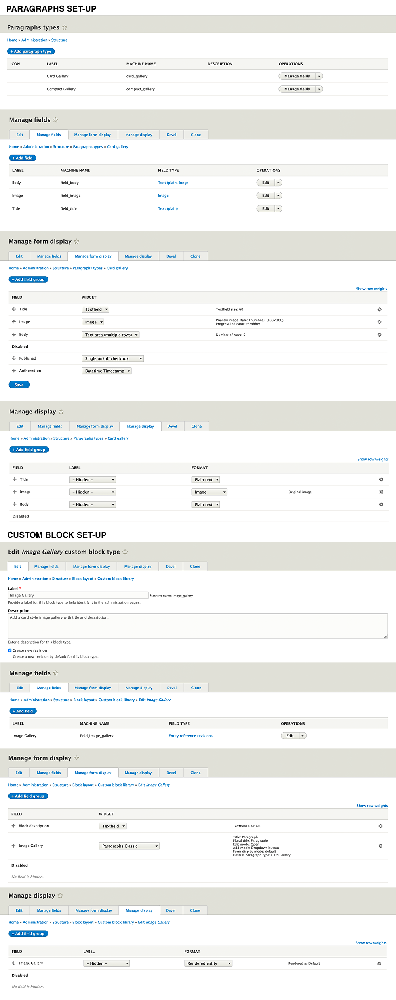

# *Add to the subtheme.libraries.yml*

#Image Gallery  
image-gallery:  
version: "1.0.x"  
css:  
theme:  
//cdnjs.cloudflare.com/ajax/libs/baguettebox.js/1.10.0/baguetteBox.min.css: { type: external }  
templates/block/custom/image_gallery/css/cards-gallery.css: {}  
dependencies:  
- core/jquery  

# *Add to the repositories section in the composer.json*

"repositories": [  
{  
"type": "vcs",  
"url": "https://github.gatech.edu/ICWebTeam/block_image_gallery.git"  
}
# *Add to the requirement in the composer.json*

"require": {  
"drupal/paragraphs": "^1.12", 
"gt/image_gallery": "dev-master",  
"mnsami/composer-custom-directory-installer": "^2.0"
},

# *Add to the installer paths in the composer.json*
"installer-paths": {  
"web/themes/contrib/subtheme/templates/block/custom/{$name}": [  
"gt/image_gallery"  
]  
},

# *Install the Paragraphs Module*
https://www.drupal.org/project/paragraphs

# **CUSTOM BLOCK  SET-UP**

